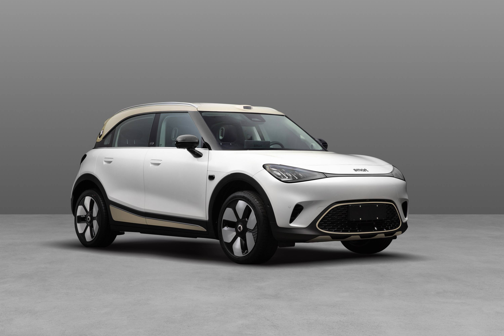

# Feed Cards · 信息流卡片设计系统 v2.4

App 首页信息流的多卡片混合排列设计规范。所有卡片共享同一套视觉语言，可在同一页面纵向排列时保持视觉协调。

## 使用流程

1. 根据用户意图选择卡片类型：商品用 `.deal-card`，原创用 `.deal-card.deal-card--article`，原创视频叠加 `.deal-card--video`，社区频道内容用 `.deal-card.deal-card--community`。
2. 先复用 [reference.html](reference.html) 中最接近的 HTML/CSS 片段，再按本文件对应章节调整字段、标签和资源。
3. 横版卡片按 375px 移动视口校验；竖版瀑布流还要执行 `fitOneLine()` 和 `layoutWaterfall()`，确保标签、价格行和两列布局不溢出。
4. 接入业务项目时删除 reference 页专属的主题切换和 tabs，只保留卡片结构、样式 token、溢出处理 JS 与瀑布流 JS。

## 卡片类型索引

| 卡片类型 | 中文名 | CSS 类名 | 状态 | 适用场景 |
|---|---|---|---|---|
| `product-card` | 商品卡片 | `.deal-card` | ✓ v1.0 起稳定 | 电商比价/优惠商品推送（即"好价卡片"） |
| `article-card` | 原创卡片 | `.deal-card.deal-card--article` | ✓ v2.0 新增 | UGC 内容（评测/开箱/攻略），footer 显示作者 |
| `article-card / video` | 原创视频变体 | `.deal-card.deal-card--article.deal-card--video` | ✓ v2.3 新增 | UGC 视频（评测视频/开箱视频），封面叠加播放按钮 |
| `community-card / large` | 社区卡片大图模式 | `.deal-card.deal-card--community.deal-card--community-large` | ✓ v2.4 新增 | 单一社区频道内容，大图优先 |
| `community-card / square` | 社区卡片方图模式 | `.deal-card.deal-card--community.deal-card--community-square` | ✓ v2.4 新增 | 单一社区频道内容，1~3 张 1:1 图片 |
| `community-card / video` | 社区卡片视频模式 | `.deal-card.deal-card--community.deal-card--community-video` | ✓ v2.4 新增 | 单一社区频道视频，左上角时长角标 |
| _（未来扩展）_ | — | — | — | — |

> 历史命名：v1.0~v1.3 期间叫"好价卡片 (good-deal-card)"，v1.4 起统一为更通用的「商品卡片 product-card」分类名。CSS 类名 `.deal-card` / `.deal-tag` 保持不变以兼容历史代码。

下方第 0 节起为**商品卡片专属规范**。新增卡片类型时另起独立章节（见第 17 节 article-card）。

---

## 0. 两种布局

| 布局 | 修饰类 | 高度 | 适用场景 |
|---|---|---|---|
| **左图右文（默认）** | `.deal-card` | 固定 139px | 信息流单条推送，纵向滚动列表 |
| **上图下文（v1.1 新增）** | `.deal-card.deal-card--vertical` | 高度随内容 | 两列瀑布流（推荐页/活动页/分类页） |

两种布局**共享所有内部组件样式**（标题/标签/价格/footer），只在容器层面用修饰类切换布局方向与尺寸。

### 0.1 状态修饰类（v1.3）

在卡片根元素 `<a>` 上叠加：

| 修饰类 | 状态 | 表现 |
|---|---|---|
| `.deal-card--soldout` | 售罄 | 价格行最左加 `售罄 \|` 前缀，整行变 `#999999` 灰色（原价仍带删除线），其他区域不变 |

## 1. 设计目标

- **价格优先**：当前价用特殊字体（PriceFont/DIN 工业风）+ 品牌红 `#E62828`，整数字号 16px 突出
- **可信背书**：通过一级红色标签（历史低价/百日新低/折扣）建立购买动机；二级灰色标签作中性补充
- **轻量信息**：来源、时间、评论数、推荐率以灰色辅助文字呈现，不抢主视觉
- **图文比例**：图片正方形 115×115 固定左对齐，信息区自适应

## 2. 整体结构

```
┌──────────────────────────────────────────────────────────────┐
│  ┌──────────┐                                                │
│  │          │  [徽标img] SK-II 神仙水 230ml 大瓶装           │
│  │  商品图   │  PITERA 精华                                   │
│  │  115x115 │                                                │
│  │          │  [历史低价] [PLUS专享] [跨店满减]              │
│  │          │                                                │
│  └──────────┘  ¥666.5 需用券 [6.5折] ¥̶1̶6̶9̶0̶                  │
│                                                              │
│                京东国际 │ 10:42         💬 8.8k  值 100%      │
└──────────────────────────────────────────────────────────────┘
```

## 3. 卡片容器规范

| 属性 | 值 |
|---|---|
| 高度 | **固定 139px** |
| 背景色 | `#FFFFFF` |
| 圆角 | 6px |
| 描边 | 无 |
| 内边距 | 12px |
| 图文间距 (gap) | 9px |
| 信息区上偏移 | `margin-top: -3px`（视觉顶对齐） |
| 页面背景 | `#F5F5F5` |
| 页面 padding | 12px |
| body max-width | 750px（PC 居中） |

## 4. 商品图 (左)

| 属性 | 值 |
|---|---|
| 容器尺寸 | 115×115px (`flex: 0 0 115px`) |
| 比例 | `aspect-ratio: 1 / 1` |
| 背景 | `#F5F5F5` |
| 圆角 | 3px |
| 图片填充 | `width:100% height:100% object-fit: cover` |

## 5. 标题区（图文环绕方案）

**关键技巧**：徽标 `` 直接放在 `<h3>` 内首位，`float: left`，文字自动环绕。

```html
<h3 class="deal-card__title">
  标题文字...
</h3>
```

| 元素 | 值 |
|---|---|
| 徽标 | `` 替代文字标签，**高度固定 15px，宽度自适应** |
| 徽标 margin | `4px 4px 0 0` |
| 标题颜色 | `#333333` |
| 标题字号 | 14px |
| 标题字重 | 600 |
| 标题行高 | 1.66 |
| 标题截断 | `height: calc(14px * 1.66 * 2)` + `overflow: hidden` 硬截断 2 行（不用 ellipsis，不破坏 float） |

> ⚠️ 不能用 `-webkit-line-clamp`，会破坏 float 环绕。

## 6. 标签行

容器 `display: flex; flex-wrap: wrap; margin-top: 7px;`
标签间距用 `margin-right: 6px`（不用 `gap`，更可控），最后一个 `margin-right: 0`。

**两级标签共享尺寸**：

| 属性 | 值 |
|---|---|
| 高度 | 15px |
| 圆角 | 3px |
| 内边距 | `0 3px` 左右各 3px，宽度自适应 |
| 字号 | 11px |
| 行高 | 1（用 `inline-flex + align-items: center` 居中） |
| 边框 | **0.5px**（Retina 实显半像素） |

**一二级差异**：

| 类型 | 文字色 | 边框色 |
|---|---|---|
| 一级 (`.deal-tag--emphasis`) | `#E62828` | `rgba(230, 40, 40, 0.4)` |
| 二级 (`.deal-tag`) | `#666666` | `rgba(102, 102, 102, 0.4)` |

折扣徽标（如 `6.5折`）也归类为一级标签，复用相同样式。

### 6.1 标签色系总览（v1.2）

5 个色系，每个色系支持 2 种形态：纯描边 / 描边+填充+图标。

| 类名 | 色值 | 配套图标 | 典型场景 | `--filled` 透明度 |
|---|---|---|---|---|
| 默认 `.deal-tag` | `#666666` 灰 | — | 中性补充（PLUS、跨店满减、送赠品） | — |
| `.deal-tag--emphasis` | `#E62828` 红 | `flash.png` | 限量抢、限时秒杀、历史低价、百日新低、折扣 | 5% |
| `.deal-tag--green` | `#10B354` 绿 | `coupon.png` | 国家补贴、领券立减、官方旗舰 | 10% |
| `.deal-tag--navy` | `#23386E` 深蓝 | `new.png` | 新品上市、官方认证、PLUS 价 | 5% |
| `.deal-tag--orange` | `#FFA129` 橙 | `time.png` | 限时抢、明天开抢、倒计时 | 5% |

### 6.2 标签 2 种形态

```html
<!-- 形态 A：纯描边（无填充无图标） -->
<span class="deal-tag deal-tag--green">国家补贴</span>

<!-- 形态 B：描边 + 填充 + 图标（重点信息，必须三者一起出现） -->
<span class="deal-tag deal-tag--green deal-tag--filled">
  国家补贴
</span>
```

> ⚠️ **不允许**「只填充无图标」或「只图标无填充」的中间态——形态 B 必须三者同时出现，保证视觉一致。

### 6.3 修饰类（与色系自由叠加）

| 类 | 作用 | 必须一起出现 |
|---|---|---|
| `.deal-tag--filled` | 加 5%-10% 同色背景 | 与 `.deal-tag__icon` |
| `.deal-tag__icon` | 标签内 15px 高图标：`margin-left: -3px` 贴齐标签左边 / `margin-right: 3px` 与文字间距 | 与 `.deal-tag--filled` |

### 6.4 CSS 变量驱动

每个色系本质是覆盖 3 个 CSS 变量：

```css
.deal-tag--green {
  --tag-color: #10B354;       /* 文字 + 边框色 */
  --tag-border: rgba(16, 179, 84, 0.4);
}
.deal-tag--green.deal-tag--filled { --tag-bg: rgba(16, 179, 84, 0.1); }
```

新增色系只需 3 行 CSS，无需改动其他规则。

### 6.5 使用约束

- **形态优先级**：形态 B（带图标）> 形态 A（描边）。卡片内最多 1 个形态 B 标签（图标是视觉焦点，多了会失焦）
- **色系搭配**：单卡建议不超过 2 个色系（如：红 + 灰、绿 + 红、深蓝 + 橙），3 色以上视觉混乱
- **标签数量**：横版卡片最多 3 个标签（标签过多挤占空间），上图下文最多 2 个
- **文案长度**：单标签不超过 8 个汉字（11px 字号下约 90px 宽），超长会挤换行
- **图标来源**：所有图标统一放在 `icons/` 目录，命名要语义化（如 `flash.png` / `coupon.png`），不要用 emoji
- **折扣徽标**（如 `6.5折`）使用 `.deal-tag--emphasis` 即可，不需要单独类

折扣徽标（如 `6.5折`）也归类为一级标签，复用相同样式。

### 6.6 标签行溢出规则（v1.3）

**只占一行，溢出时整体隐藏最右侧标签**（不裁切半个标签）。

CSS：
```css
.deal-card__tags {
  display: flex;
  flex-wrap: nowrap;
  overflow: hidden;
}
.deal-card__tags > * { flex-shrink: 0; }
```

JS（统一处理标签 + 价格行，见第 7.5 节）：检测 `scrollWidth > clientWidth`，从右到左隐藏。

**HTML 顺序即优先级**（左 = 最重要 = 最后被隐藏）：
> **图标标签 → 一级（emphasis/green/navy/orange） → 二级（默认灰）**

```html
<!-- 写法示例：图标标签优先 -->
<div class="deal-card__tags">
  <span class="deal-tag deal-tag--emphasis deal-tag--filled">限量抢</span>
  <span class="deal-tag deal-tag--emphasis">百日新低</span>
  <span class="deal-tag">PLUS专享</span>
</div>
```

### 6.7 商品大标签变体 `.deal-tag--product`（v2.1 新增）

**用途**：原创卡片中关联具体商品（评测、开箱、攻略等场景），承载商品图 + 商品名 + 价格。**仅 article-card 使用**，商品卡片不需要。

**结构**：

```html
<span class="deal-tag deal-tag--product">
  
  <span class="deal-tag--product__name">佳明 fenix 8 智能运动手表 51mm</span>
  <span class="deal-tag--product__price">
    <span class="symbol">¥</span><span class="integer">6280.</span><span class="decimal">0</span>
  </span>
</span>
```

**外壳样式 `.deal-tag--product`**：

| 属性 | 值 |
|---|---|
| 高度 | 20px（比普通标签 15px 高） |
| 圆角 | 3px |
| 背景 | `#F5F5F5` |
| 边框 | 无 |
| 内边距 | `0 6px 0 1px`（左 1px 紧贴图片，右 6px 留白） |
| 字号 | 11px |
| 行高 | 14px |
| 颜色 | `#666666` |
| 最大宽度 | `100%` 占满标签行 |
| 溢出 | `overflow: hidden`（用户名 ellipsis 截断） |

**子元素**：

| 元素 | 规则 |
|---|---|
| `__image` | 18×18px，圆角 2px，`object-fit: cover`，与商品名间距 6px (margin-right) |
| `__name` | 11px / 14px / `#666666`，单行 ellipsis 截断（`min-width: 0`），与价格间距 6px (margin-right) |
| `__price` | 字体 `'ZhiNumberThin'` 细体（fallback PriceFont），3 段拼接（symbol/integer/decimal）字号 10/11/10，颜色 `#666666` |

**收缩优先级**：商品图、价格不收缩；用户名（实际是商品名）优先 ellipsis。

**数据接口**：

```typescript
interface ProductTag {
  image: string;       // 商品图 URL
  name: string;        // 商品名
  price?: {            // 可选：商品价格
    integer: string;   // "6280." 含小数点
    decimal?: string;  // "0" 仅小数数字
  };
}
```

## 7. 价格区

容器 `display: flex; align-items: baseline; flex-wrap: wrap; margin-top: 4px;`
段间距用 `margin-right: 3px`。

> ⚠️ `margin-top: 4px` 是为了抵消整数 `line-height: 20px` 上方约 4px 的 line-box 余白，**实际视觉间距 ≈ 8px**。

### 7.1 当前价（特殊字体 + 三段拼接）

```html
<span class="deal-card__price-current">
  <span class="symbol">¥</span><span class="integer">666.</span><span class="decimal">5</span>
</span>
```

字体链（PriceFont 自定义 + DIN/Impact fallback）：
```css
font-family: 'PriceFont', 'DIN Alternate', 'DIN Condensed', 'Oswald',
             'Bebas Neue', 'Impact', 'Helvetica Neue', sans-serif;
font-feature-settings: 'tnum';
font-variant-numeric: tabular-nums;
letter-spacing: 0.01em;
```

| 段 | 字号 | 行高 | 备注 |
|---|---|---|---|
| `¥` symbol | 13px | 15px | 字重 600 |
| `666.` integer | 16px | 20px | **小数点归整数部分** |
| `5` decimal | 13px | 15px | 仅小数数字 |

颜色 `#E62828`，字重 700，**baseline 对齐**（数字踩在同一基线上，整数向上突出）。

自定义字体 `@font-face`：
```css
@font-face {
  font-family: 'PriceFont';
  src: url('./fonts/price.ttf') format('truetype');
  font-display: swap;
}
```

### 7.2 凑单/用券提示

| 属性 | 值 |
|---|---|
| 颜色 | `#E62828` |
| 字号 | 13px |
| 行高 | 15px |

### 7.3 划线原价

| 属性 | 值 |
|---|---|
| 颜色 | `#999999` |
| 字号 | 13px |
| 行高 | 15px |
| 装饰 | `text-decoration: line-through` |
| 包裹标签 | `<s>` + `aria-label="原价 X 元"`（防 SR 误读） |

### 7.4 售罄态价格行（v1.3）

在卡片根加 `.deal-card--soldout` 即可，价格行 HTML 加售罄前缀：

```html
<a class="deal-card deal-card--soldout" href="#">
  <!-- ... -->
  <div class="deal-card__price-row">
    <span class="deal-card__soldout-label">售罄</span>
    <span class="deal-card__soldout-divider">|</span>
    <span class="deal-card__price-current">
      <span class="symbol">¥</span><span class="integer">3299</span>
    </span>
    <s class="deal-card__price-original" aria-label="原价 4690 元">¥4690</s>
  </div>
</a>
```

| 元素 | 字号 | 行高 | 颜色 |
|---|---|---|---|
| `售罄` (`__soldout-label`) | 15px | 1.2 | `#999999` |
| `\|` (`__soldout-divider`) | 15px | 1.2 | `#D9D9D9` |
| 当前价 / 凑单提示 | 同 7.1 / 7.2 | 同前 | **被覆盖为 `#999999`**（CSS 由 `.deal-card--soldout` 选择器覆盖） |
| 原价 | 同 7.3 | 同前 | `#999999`（与默认色一致） |

注意：
- 凑单提示（`需用券` 等）通常移除，但保留也不冲突，色会变灰
- 标签行和 footer 不变（标签可能仍是促销红色，与售罄状态语义可矛盾，建议同时清空标签或仅留 1 个二级灰）

### 7.5 价格行溢出规则（v1.3）

与 6.6 标签行同样规则：**只占一行，溢出时从右到左隐藏整段**。

CSS：
```css
.deal-card__price-row {
  display: flex;
  flex-wrap: nowrap;
  overflow: hidden;
}
.deal-card__price-row > * { flex-shrink: 0; }
```

**HTML 顺序即优先级**（左 = 最重要）：
> **当前价 → 凑单提示 → 折扣徽标 → 原价**
> 或售罄态：**售罄前缀 → 当前价 → 原价**

JS（与标签行共用一段，统一处理）：

```javascript
function fitOneLine(container) {
  var items = Array.from(container.children);
  items.forEach(function(t) { t.style.display = ''; });
  for (var i = items.length - 1; i >= 0; i--) {
    if (container.scrollWidth <= container.clientWidth + 1) break;
    items[i].style.display = 'none';
  }
}
function fitAll() {
  document.querySelectorAll('.deal-card__tags, .deal-card__price-row').forEach(fitOneLine);
}
// 触发时机：DOM ready / load / resize（防抖 100ms）
```

完整 JS 见 [reference.html](reference.html) 文件末尾的 `<script>` 块。

## 8. Footer 信息行（自适应防重叠）

容器：
```css
.deal-card__footer {
  margin-top: 7px;
  margin-right: -3px;     /* 让右侧 meta 距卡片边 9px */
  display: flex;
  justify-content: space-between;
  align-items: center;
  gap: 9px;               /* 左右两部分最小间距 */
  color: #999;
  font-size: 12px;
}
```

### 8.1 左侧 source（可截断）

```html
<span class="deal-card__source">
  <span class="deal-card__source-channel">京东国际</span>
  <span class="deal-card__divider">│</span>
  <span class="deal-card__source-time">10:42</span>
</span>
```

- `.deal-card__source` 加 `min-width: 0; flex: 0 1 auto;` — **允许收缩**
- `.deal-card__source-channel` 渠道名加 `overflow: hidden; text-overflow: ellipsis; white-space: nowrap;` — **空间不足时截断为 …**
- `.deal-card__divider` + `.deal-card__source-time` 加 `flex: 0 0 auto;` — **始终完整显示**
- 行高 15px，分隔符颜色 `#D9D9D9`

**时间格式规则**（v1.3）：

| 上线时机 | 显示格式 | 示例 |
|---|---|---|
| 当天 | `HH:mm` | `10:42` |
| 非当天（昨天 / 更早） | `MM-DD` | `05-27` |

> ⚠️ **不要用相对时间词**（昨日、前天、3 天前等），统一用数字。便于扫读，节省空间。年份默认不展示（同一年内），跨年场景另议。

### 8.2 右侧 meta（不收缩）

```css
.deal-card__meta {
  display: inline-flex;
  align-items: center;
  gap: 0;             /* 评论与值无间距 */
  line-height: 1.2;
  flex: 0 0 auto;     /* 不收缩 */
}
```

每个 meta-item：
- 图标 13×13px，`` / ``
- 图标与数字间距 2px (`gap: 2px`)
- 数字宽度固定（防止抖动）：
  - 评论数字 `.deal-card__meta-value`: width 29px
  - 推荐率数字 `.deal-card__meta-value--zhi`: width 32px

**优先级**：宽度不足时只截断渠道名，分隔符 / 时间 / 整个右侧 meta 始终完整可见。

## 9. 颜色 Token (v2.2 重构为 CSS 变量驱动)

v2.2 起所有颜色用语义化 CSS 变量定义，支持深色模式自动切换 + 手动覆盖。

### 9.1 浅色模式 token（基线）

```css
:root {
  --c-text-primary: #333333;     /* 主文字（标题、商品名） */
  --c-text-secondary: #666666;   /* 次级文字（二级标签、商品大标签） */
  --c-text-muted: #999999;       /* 辅助文字（footer、原价、售罄、话题入口） */
  --c-brand-red: #E62828;        /* 价格红、一级标签红 */
  --c-bg-page: #F5F5F5;          /* 页面背景、商品图底色 */
  --c-bg-card: #FFFFFF;          /* 卡片背景 */
  --c-bg-card-active: #FAFAFA;   /* 卡片按下态 */
  --c-bg-product-tag: #F5F5F5;   /* 商品大标签底色（与页面背景独立） */
  --c-divider: #D9D9D9;          /* 分隔符 │、灰色边框 */
  --c-border-light: #EAEAEA;     /* 极浅描边 */
}
```

### 9.2 深色模式 token

```css
@media (prefers-color-scheme: dark) {
  :root {
    --c-text-primary: #E0E0E0;
    --c-text-secondary: #A0A0A0;
    --c-text-muted: #6C6C6C;
    --c-brand-red: #F04848;
    --c-bg-page: #121212;
    --c-bg-card: #222222;
    --c-bg-card-active: #2A2A2A;
    --c-bg-product-tag: #353535;
    --c-divider: #6C6C6C;
    --c-border-light: #2A2A2A;
  }
}
```

### 9.3 三层主题切换

| 优先级 | 触发方式 | 选择器 |
|---|---|---|
| 最高 | 手动开关：浅色 | `[data-theme="light"]` |
| 中 | 手动开关：深色 | `[data-theme="dark"]` |
| 低 | 系统偏好 | `@media (prefers-color-scheme: dark)` |

**用法**：

```javascript
// 跟随系统：什么都不写
// 强制深色：document.documentElement.setAttribute('data-theme', 'dark')
// 强制浅色：document.documentElement.setAttribute('data-theme', 'light')
```

### 9.4 浅色 ↔ 深色色值映射

| 用途 | 浅色 | 深色 |
|---|---|---|
| 主文字 | `#333333` | `#E0E0E0` |
| 次级文字 | `#666666` | `#A0A0A0` |
| 辅助文字 | `#999999` | `#6C6C6C` |
| 品牌红 | `#E62828` | `#F04848` |
| 页面/图底 | `#F5F5F5` | `#121212` |
| 卡片底 | `#FFFFFF` | `#222222` |
| 卡片按下 | `#FAFAFA` | `#2A2A2A` |
| 商品大标签底 | `#F5F5F5` | `#353535` |
| 分隔符 | `#D9D9D9` | `#6C6C6C` |
| 极浅描边 | `#EAEAEA` | `#2A2A2A` |

### 9.5 深色模式层次设计

深色模式下三个背景色按"高度"递进，避免扁平：

- 页面 `#121212`（最低）
- 卡片 `#222222`（中等，约高于页面 1 级）
- 商品大标签 `#353535`（最高，作为卡片内的次级面）

不要把商品大标签的色值统一为 `--c-bg-page`，否则深色下与页面融为一体看不出层次。

### 9.6 历史变量兼容

`--deal-*` 系列变量保留为 token 别名（如 `--deal-text-secondary: var(--c-text-secondary)`），项目中老代码引用不会断裂。新代码请直接用 `--c-*`。

## 10. 字体规范

```css
font-family: -apple-system, BlinkMacSystemFont, "PingFang SC",
             "Hiragino Sans GB", "Microsoft YaHei", "Helvetica Neue", sans-serif;
```

价格数字使用独立字体链（见 7.1）。

## 11. 自适应规则

- **viewport**：`width=device-width, initial-scale=1.0`
- **html, body**：`width: 100%`
- **body**：`max-width: 750px; margin: 0 auto;`（移动端撑满，PC 居中）
- **图片**：`flex: 0 0 115px` 固定不缩
- **信息区**：`flex: 1; min-width: 0` 自适应（`min-width: 0` 必须，否则子级 ellipsis 失效）
- **footer 内部**：渠道名可截断，分隔符 / 时间 / 右侧 meta 不收缩

## 12. 资源文件清单

| 文件 | 用途 |
|---|---|
| `fonts/price.ttf` | 价格特殊字体 |
| `icons/comment.svg` | 评论气泡 |
| `icons/zhi.svg` | "值"图标 |
| `image/badge.png` | 标题前徽标（如"绝对值"） |
| `image/` | 业务图片目录（徽标、商品图） |
| 商品图 | 项目自有，建议 PNG 透明底 |

## 13. 数据接口

```typescript
interface GoodDealCardProps {
  image: string;
  imageAlt?: string;
  badgeImage?: string;            // 徽标图 URL（如绝对值/神价格）
  badgeAlt?: string;
  title: string;
  tags: Array<{
    text: string;
    emphasis?: boolean;           // true = 一级红，false = 二级灰
  }>;
  price: {
    current: string;              // "666.5" — 字符串避免精度问题
    original?: number;
    discount?: string;            // "6.5折"
    note?: string;                // "需用券"
  };
  source: string;                 // "京东国际"
  postedAt: string;               // "10:42"
  commentCount: string;           // "8.8k"
  recommendRate: string;          // "100%"
  onClick?: () => void;
}
```

## 14. 反例（绝对禁止）

- 不要使用渐变背景、玻璃拟态、霓虹色
- 不要给标签或卡片加阴影
- 不要把所有标签都做成红色（一级标签是稀缺资源）
- 不要使用纯黑 `#000` 作正文
- 不要使用 emoji 替代评论 / 推荐图标，必须用 SVG
- 不要使用 `border-radius: 9999px` (pill 形)
- 不要在卡片内嵌套另一张卡片
- 不要用 `-webkit-line-clamp` 截断标题（会破坏徽标 float 环绕）

## 15. 参考实现

参见 [reference.html](reference.html)，包含：
- 完整 CSS（含 `@font-face`、所有自适应规则、防重叠/截断）
- 三个示例（默认完整态、长标题截断、窄屏渠道名截断）
- 资源占位（image/badge.png / image/shoe.png / icons/*.svg / fonts/price.ttf）

资源文件位于同目录的 `image/`、`icons/`、`fonts/` 子目录下，使用时按需替换。

---

## 16. 上图下文布局 `.deal-card--vertical`（v1.1）

适用于**两列瀑布流**场景。所有内部元素（标题/标签/价格/footer）样式复用，仅容器与少数细节差异。

### 16.1 瀑布流容器

```css
.deal-grid {
  display: grid;
  grid-template-columns: 1fr 1fr;
  gap: 5px;
}
```

- 两列等宽，列间距 5px
- 在 375 视口 + 5px body padding 下，每列约 180px

### 16.2 卡片容器差异

| 属性 | 水平版 (.deal-card) | 上图下文 (.deal-card--vertical) |
|---|---|---|
| flex-direction | row | column |
| height | 139px 固定 | auto 随内容 |
| padding | 12px | 0（图片撑满） |
| border-radius | 6px | **3px** |
| overflow | visible | hidden（保证图片裁圆） |

### 16.3 图片区

| 属性 | 值 |
|---|---|
| 宽度 | 100%（撑满列宽） |
| 比例 | `aspect-ratio: 1 / 1` |
| 圆角 | 0（继承卡片顶圆角 + overflow:hidden） |

### 16.4 信息区

| 属性 | 值 |
|---|---|
| padding | **9px**（四边一致） |
| margin-top | 0（覆盖水平版的 -3px） |

### 16.5 各区块垂直间距（覆盖水平版）

| 区块 | margin-top |
|---|---|
| 标签行 | 9px（水平版 7px） |
| 价格行 | 9px（水平版 4px） |
| Footer | 9px（水平版 7px） |

> 注：价格行因整数 `line-height: 20px` 有约 4px line-box 余白，实际视觉间距 ≈ 13px。

### 16.6 标题字号差异

| 属性 | 水平版 | 上图下文 |
|---|---|---|
| 字号 | 14px | 14px |
| 字重 | **600** | **400 常规** |
| 行高 | 1.66 (≈23px) | **20px 固定** |
| 截断 | `height` 硬定 2 行 | `max-height` 软截 2 行（短标题不留白） |

### 16.7 Footer 简化版（左侧只显商城）

```html
<div class="deal-card__footer">
  <span class="deal-card__source">
    <span class="deal-card__source-channel">天猫商城</span>
    <!-- 不再渲染 divider 和 source-time -->
  </span>
  <span class="deal-card__meta">...</span>
</div>
```

- 去掉 │ 和时间
- 右侧 meta（评论 + 推荐率）保留不变
- `margin-right: 0` 覆盖水平版的 -3px

### 16.8 单卡尺寸估算（375 视口下）

| 区块 | 高度 |
|---|---|
| 图片 | 180px |
| 信息区 padding-top | 9px |
| 标题（2 行满） | 40px |
| 标签行（9+15） | 24px |
| 价格行（9+20+余白） | 33px |
| Footer（9+15） | 24px |
| 信息区 padding-bottom | 9px |
| **合计** | **≈ 319px** |

短标题 1 行时少 20px → 约 299px。

### 16.9 完整示例

```html
<div class="deal-grid">
  <a class="deal-card deal-card--vertical" href="#" aria-label="...">
    <div class="deal-card__image-wrap">
      
    </div>
    <div class="deal-card__info">
      <h3 class="deal-card__title">
        商品标题
      </h3>
      <div class="deal-card__tags">
        <span class="deal-tag deal-tag--emphasis">历史低价</span>
        <span class="deal-tag">国家补贴</span>
      </div>
      <div class="deal-card__price-row">
        <span class="deal-card__price-current">
          <span class="symbol">¥</span><span class="integer">368.</span><span class="decimal">1</span>
        </span>
        <span class="deal-card__price-note">需用券</span>
        <s class="deal-card__price-original" aria-label="原价 699 元">¥699</s>
      </div>
      <div class="deal-card__footer">
        <span class="deal-card__source">
          <span class="deal-card__source-channel">天猫商城</span>
        </span>
        <span class="deal-card__meta">...</span>
      </div>
    </div>
  </a>
  <!-- 第二张卡片 -->
</div>
```

### 16.10 注意事项

- "高度随内容" 模式下，同一行两张卡片高度不齐平（标题字数/标签数量不同）
- 若需对齐，可改用 CSS Grid 的 `align-items: stretch`（默认）或为标题加固定高度
- 价格区在窄列宽下可能换行；如要避免，可减少同时显示的元素（如去掉 note 或 discount）

---

## 17. 原创卡片 article-card（v2.0 新增）

UGC 内容卡片，复用商品卡片骨架，差异点全部以 `.deal-card--article` 修饰类承载——HTML 结构、容器样式、商品图、标题、标签、单行溢出 JS 全部不变。

### 17.1 与商品卡片的差异

| 维度 | 商品卡片 (`.deal-card`) | 原创卡片 (`.deal-card.deal-card--article`) |
|---|---|---|
| 价格行 | 显示 | **`display: none` 隐藏**（HTML 可保留空容器或省略） |
| 标签 | 一级 + 二级，最多 3 个 | 一级 + 二级，最多 3 个；**一级语义改为内容信号**（如精华/热门/编辑推荐），不再是促销信号 |
| Footer 左侧 | `.deal-card__source`：商城名 \| 时间 | `.deal-card__author`：18px 圆头像 + 用户名 + 12px 认证角标 |
| Footer 右侧 - 第二项 | `值` 图标 + 推荐率 100% | `thumb-up` 图标 + 点赞数 1.2k |

### 17.2 完整 HTML 模板

```html
<a class="deal-card deal-card--article" href="#" aria-label="...">
  <div class="deal-card__image-wrap">
    
  </div>
  <div class="deal-card__info">
    <div>
      <h3 class="deal-card__title">开箱体验 · 佳明 fenix 8 智能运动手表</h3>
      <div class="deal-card__tags">
        <span class="deal-tag">运动装备</span>
        <span class="deal-tag">长测</span>
      </div>
    </div>
    <div>
      <!-- 价格行 CSS 已隐藏，可保留以兼容数据接口或直接省略 -->
      <div class="deal-card__price-row" aria-hidden="true"></div>

      <div class="deal-card__footer">
        <span class="deal-card__author">
          
          <span class="deal-card__author-name">山野徒步者</span>
          
        </span>
        <span class="deal-card__meta">
          <span class="deal-card__meta-item" aria-label="356 条评论">
            
            <span class="deal-card__meta-value">356</span>
          </span>
          <span class="deal-card__meta-item" aria-label="1200 个赞">
            
            <span class="deal-card__meta-value deal-card__meta-value--like">1.2k</span>
          </span>
        </span>
      </div>
    </div>
  </div>
</a>
```

### 17.3 作者区组件

#### `.deal-card__author` 容器
- `display: inline-flex; align-items: center;`
- `min-width: 0; flex: 0 1 auto;`（允许收缩，让用户名 ellipsis 生效）
- 不用 `gap`，间距由内部元素的 `margin-right` 控制（精确）

#### `.deal-card__author-avatar` 头像
| 属性 | 值 |
|---|---|
| 尺寸 | 18×18px |
| 圆角 | `50%` 完全圆 |
| 边框 | 无 |
| 填充 | `object-fit: cover` 自动裁切居中 |
| 收缩 | `flex: 0 0 18px` 不收缩 |
| 与用户名间距 | `margin-right: 6px` |

#### `.deal-card__author-name` 用户名
- 颜色继承 footer 的 `#999`，字号 12px
- `overflow: hidden; text-overflow: ellipsis; white-space: nowrap; min-width: 0;`
- 容器空间不足时自动 `…` 截断

#### `.deal-card__author-badge` 认证角标
| 属性 | 值 |
|---|---|
| 尺寸 | 12×12px |
| 收缩 | `flex: 0 0 12px` 不收缩 |
| 与用户名间距 | `margin-left: 3px` |
| 资源 | 默认 `icons/yellow-v.png`（黄 V 认证），可换其他色系角标 |

### 17.4 Footer 缩窄优先级

footer 容器 `gap: 9px` 保证左右两侧最少 9px 间距，缩窄时：

1. **优先截断用户名** ← 唯一会变 `…` 的元素
2. 头像、认证角标始终完整显示
3. 右侧整组 meta（评论 + 点赞）始终完整显示

### 17.5 thumb-up 替代值图标

仅一处差异：右侧 meta 的第 2 个 `meta-item`：

| 商品卡片 | 原创卡片 |
|---|---|
| `` | `` |
| `meta-value--zhi`（width 32px） | `meta-value--like`（width 29px） |
| 内容：推荐百分比（`100%`） | 内容：点赞数（`1.2k` / `356` 等） |

### 17.6 使用约束

- **一级标签语义切换**：商品卡片用红/绿/深蓝/橙等一级标签传达"促销/降价/政策"信号；原创卡片同样可用一级标签，但语义切换为**内容信号**（精华、热门、编辑推荐、新人扶持、年度精选等）。颜色含义不变：红=最强信号、绿=补贴/福利类、深蓝=身份/官方、橙=时间/限时。
- **不要混淆语义**：原创卡片不要用一级红打"历史低价"这类促销标签（语义错配），但可以打"年度精选"
- **价格行处理**：HTML 可省略 `.deal-card__price-row` div，或保留空 div（CSS 已隐藏，不影响布局）。保留更便于运营数据从同一接口切换商品/原创两种状态
- **认证角标可选**：`.deal-card__author-badge` 是可选元素，无认证用户直接不渲染该 `` 即可
- **不支持上图下文布局**：v2.0 article-card 仅水平版。瀑布流形态待后续版本

### 17.7 数据接口

```typescript
interface ArticleCardProps {
  cover: string;             // 封面图 URL
  coverAlt?: string;
  title: string;             // 标题
  tags?: Array<{ text: string }>;  // 仅文本，不区分级别（全是二级）
  author: {
    avatar: string;          // 头像 URL
    name: string;            // 用户名
    badge?: string;          // 可选：认证角标 URL（如 yellow-v.png）
  };
  commentCount: string;      // "356"
  likeCount: string;         // "1.2k"
  onClick?: () => void;
}
```

### 17.8 竖版原创卡片（v2.1 新增）

article-card 与 vertical 布局**可叠加使用**，构成两列瀑布流场景下的原创卡片。

**类名组合**：
```html
<a class="deal-card deal-card--vertical deal-card--article" href="#">
```

**与横版原创卡片的差异**：

| 维度 | 横版原创卡 (`.deal-card.deal-card--article`) | 竖版原创卡 (再叠加 `.deal-card--vertical`) |
|---|---|---|
| 商品图位置 | 左侧 115×115px | 顶部 100% 宽，比例可选（见下方） |
| 信息区 padding | 0（继承自横版 12px 卡片 padding） | **9px 四边一致**（与卡片边界保持安全距离） |
| 信息区排列 | flex 默认（`space-between`） | **`flex-start` 紧凑排列**（覆盖 vertical 的 space-between，避免空间被拉伸） |
| 各区块间距 | `margin-top: 7px` 等 | **统一 9px**（标签 / footer / 商品大标签上下） |
| Footer 评论项 | 显示 | **隐藏**（`.deal-card__meta-item--comment` `display: none`），仅保留点赞 |
| Footer 左侧 | 作者区（同横版） | 同左：作者头像 + 用户名 + 认证角标 |

**商品大标签置顶变体**：当卡片用了 `.deal-tag--product` 商品大标签时，标签行**置于标题上方**：

```html
<div class="deal-card__info">
  <div class="deal-card__tags deal-card__tags--top">
    <span class="deal-tag deal-tag--product">...</span>
  </div>
  <h3 class="deal-card__title">...</h3>
  <div class="deal-card__price-row" aria-hidden="true"></div>
  <div class="deal-card__footer">...</div>
</div>
```

- `.deal-card__tags--top` 修饰类：`margin-top: 0`（紧贴信息区顶部 / 距图片 9px），`margin-bottom: 9px`（距标题 9px）
- 普通标签行（无 `--top`）则按默认顺序（标题之后）

### 17.9 图片比例修饰类（v2.1 新增）

仅适用于竖版原创卡片，可视内容性质选择：

| 修饰类 | 比例 | 适用场景 |
|---|---|---|
| 默认（无修饰类） | **1:1** | 数码/数字内容/横平竖直构图 |
| `.deal-card__image-wrap--3-4` | **3:4** | 旅行/人物/服饰/竖屏摄影 |
| `.deal-card__image-wrap--4-3` | **4:3** | 数码/横屏视频/横向构图 |

**用法**：

```html
<!-- 1:1 默认 -->
<div class="deal-card__image-wrap">
<!-- 3:4 -->
<div class="deal-card__image-wrap deal-card__image-wrap--3-4">
<!-- 4:3 -->
<div class="deal-card__image-wrap deal-card__image-wrap--4-3">
```

**约束**：

- 同一两列瀑布流内**允许混合比例**，左右两列卡片高度自然不齐（瀑布流应有效果）
- 配合 `.deal-grid` 容器的 `align-items: start`（v2.1 新增）确保两张卡片不被强行拉伸到等高
- 横版卡片不支持比例修饰类（横版图片始终 115×115）

### 17.10 .deal-grid 瀑布流容器（v2.2 修订）

**演进**：

- v1.1：CSS Grid（`display: grid`） — 同行卡片被强行拉伸到等高（`align-items: stretch` 默认）
- v2.1：CSS Grid + `align-items: start` — 同行顶对齐，但左卡更长时右下方留**空白**
- **v2.2：JS 重排**（`position: absolute`）— 紧密堆叠 + 重要性逐行视觉，无空白

**当前实现**：

```css
.deal-grid {
  position: relative;
  margin-top: 5px;
}
.deal-grid > .deal-card {
  position: absolute;
  width: calc((100% - 5px) / 2);   /* 两列等宽，列间距 5px */
  box-sizing: border-box;
}
```

```javascript
function layoutWaterfall(grid) {
  var cards = Array.from(grid.children);
  if (!cards.length) return;
  var GAP = 5;
  var colWidth = (grid.clientWidth - GAP) / 2;
  var colHeights = [0, 0];

  cards.forEach(function(card, i) {
    var col;
    if (i === 0) col = 0;          // 第 1 张固定左列（保证逐行视觉起始）
    else if (i === 1) col = 1;     // 第 2 张固定右列
    else col = colHeights[0] <= colHeights[1] ? 0 : 1;  // 之后选短列接续

    card.style.left = col === 0 ? '0' : (colWidth + GAP) + 'px';
    card.style.top = colHeights[col] + 'px';
    colHeights[col] += card.offsetHeight + GAP;
  });

  grid.style.height = Math.max(colHeights[0], colHeights[1]) - GAP + 'px';
}
```

**触发时机**：
- DOMContentLoaded（初次渲染）
- load（图片/字体加载完成后重排，因图片高度变化）
- resize（窗口宽度变化重新计算）
- tab 切换（`display:none → block` 时 clientWidth=0，必须重算）

**特性**：
- 卡片间垂直间距严格 5px，列间距 5px
- 重要性逐行视觉：第 1、2 张固定左右起始，第 3 张起按"短列优先"接续
- 紧密堆叠无空白，类似 Pinterest 瀑布流但保留运营优先级语义
- HTML 顺序 = 重要性排序

**注意**：
- 卡片尺寸变化（如懒加载图片到位）需要再次触发 `layoutWaterfall`
- React/Vue 等框架接入时，列表数据变化后调用一次重排
- 该 JS 是 reference 内嵌的最简实现，不超过 30 行；项目可换 Masonry.js 等成熟库

### 17.11 视频变体 `.deal-card--video`（v2.3 新增）

**复用 article-card 骨架**，仅在封面图叠加播放按钮，标识"这是视频内容"。HTML 仅多 1 个节点，CSS 通过修饰类承载差异。

**为什么是修饰类而非独立卡片类型**：视频卡与原创卡的结构 100% 一致（同样的标题/标签/作者区/互动数），唯一差异是封面上的播放图标。这种"是 X 的一个变体"的关系，修饰类比独立类型更合适。同类业务（知乎、小红书、B 站）都按此设计。

**类组合**：

```html
<!-- 横版视频卡 -->
<a class="deal-card deal-card--article deal-card--video" href="#">
  <div class="deal-card__image-wrap">
    
    <span class="deal-card__play">
      
    </span>
  </div>
  <!-- 其余结构与 article-card 完全一致 -->
</a>

<!-- 竖版视频卡（瀑布流） -->
<a class="deal-card deal-card--vertical deal-card--article deal-card--video" href="#">
  ...
</a>
```

**CSS 规则**：

```css
.deal-card--video .deal-card__image-wrap {
  position: relative;       /* 让 .deal-card__play absolute 定位有参照 */
}
.deal-card__play {
  position: absolute;
  pointer-events: none;     /* 不拦截卡片点击 */
  display: flex;
  align-items: center;
  justify-content: center;
  background: rgba(0, 0, 0, 0.4);
  backdrop-filter: blur(4px);
  -webkit-backdrop-filter: blur(4px);
}
```

**横版**（45px 圆 / 21px 图标 / 居中）：

```css
.deal-card:not(.deal-card--vertical).deal-card--video .deal-card__play {
  top: 50%;
  left: 50%;
  transform: translate(-50%, -50%);
  width: 45px;
  height: 45px;
  border-radius: 50%;
}
.deal-card:not(.deal-card--vertical).deal-card--video .deal-card__play img {
  width: 21px;
  height: 21px;
}
```

**竖版**（18px 圆 / 10px 图标 / 右上角，距边各 9px）：

```css
.deal-card--vertical.deal-card--video .deal-card__play {
  top: 9px;
  right: 9px;
  width: 18px;
  height: 18px;
  border-radius: 50%;
}
.deal-card--vertical.deal-card--video .deal-card__play img {
  width: 10px;
  height: 10px;
}
```

**视觉规格汇总**：

| 维度 | 横版 | 竖版 |
|---|---|---|
| 位置 | 图片正中央 | 右上角，距上/距右 9px |
| 背景圆尺寸 | 45×45px | 18×18px |
| 图标尺寸 | 21×21px | 10×10px |
| 背景色 | `rgba(0,0,0,0.4)` 黑 40% | 同左 |
| 玻璃模糊 | `backdrop-filter: blur(4px)` | 同左 |

**资源**：`icons/play-fill.svg`（白色实心三角箭头）

**数据接口**：

```typescript
interface VideoCardProps extends ArticleCardProps {
  video: true;            // 标记为视频，业务层据此添加 .deal-card--video 类
  // 未来可扩展：duration?: string、coverGif?: string 等视频专属字段
}
```

**互斥/兼容**：
- ✓ 与所有 article-card 变体兼容：常规标签、商品大标签、话题入口
- ✓ 与图片比例修饰类兼容：1:1 / 3:4 / 4:3 都可叠加
- ✓ 与瀑布流兼容：`.deal-card--vertical.deal-card--article.deal-card--video` 三类叠加正常

**未来扩展空间**（不在 v2.3 中实现，记录方向）：
- 时长徽标（如 `0:42`）：右下角小标签
- 横版 .deal-card 商品卡也可以做视频变体（只需复用同一 CSS，不必再写新规则）
- 自动播放预览：JS 监听 IntersectionObserver，进入视口时换 GIF 或 muted video
- 当视频专属元素累计 ≥ 5 个差异时，再升格为独立卡片类型

## 18. 话题入口 .deal-card__topic（v2.2 新增）

**用途**：竖版卡片标题上方的话题/分类入口，点击跳转该话题聚合页。两种卡片类型（商品/原创）均可使用。

**结构**：

```html
<span class="deal-card__topic">
  
  家居好物
</span>
```

**样式**：

| 元素 | 规则 |
|---|---|
| `.deal-card__topic` | inline-flex / `align-items: center` / 文字 11px / 行高 13px / 颜色 `var(--c-text-muted)` `#999` |
| `.deal-card__topic-icon` | 13×13px / `flex: 0 0 13px` / `margin-right: 1px`（与文字间距） |
| 上下间距 | margin-top 9px（如非信息区首位）/ margin-bottom 9px（与下方元素间距） |
| 作为信息区首位 | `:first-child` 选择器 → `margin-top: 0`（信息区 padding 已提供 9px） |

**资源**：图标默认 `icons/topic-star.svg`，13×13px。可替换为其他话题图标（不同分类用不同剪影）。

**位置**：始终位于信息区**最顶部**（标题之前、商品大标签之前）。

### 18.1 互斥规则：与商品大标签

**话题入口与商品大标签不可同时出现，话题入口优先级更高。**

CSS 自动处理：

```css
.deal-card--vertical .deal-card__info:has(> .deal-card__topic) > .deal-card__tags--top {
  display: none;
}
```

即使 HTML 里同时写了两者，渲染时商品大标签会被隐藏。

**业务建议**：
- 数据层面只下发其中一种（话题字段优先）
- 同一卡片如果既有话题又有关联商品，建议把"商品"信息融入标题或下方标签行

> 注：`:has()` 在 Chrome 105+ / Safari 15.4+ / Firefox 121+ 支持。极旧浏览器会两者同时显示，请在数据层兜底。

### 18.2 数据接口

```typescript
interface TopicEntry {
  text: string;     // 话题名（如「家居好物」「数码评测」）
  icon?: string;    // 图标 URL，默认 './icons/topic-star.svg'
  href?: string;    // 跳转链接（话题聚合页）
}
```

---

## 19. 社区卡片 community-card（v2.4 新增）

单一社区频道专用内容卡，不参与首页商品卡/原创卡混排。复用 `.deal-card` 容器、颜色 token、头像/认证/话题/互动图标资源，但高度随内容，不使用商品价格区和商城 source。

### 19.1 类名与模式

| 模式 | 类名 | 媒体规则 |
|---|---|---|
| 大图模式 | `.deal-card.deal-card--community.deal-card--community-large` | 单张图，`aspect-ratio: 341 / 146`，图片圆角 3px |
| 方图模式 | `.deal-card.deal-card--community.deal-card--community-square` | 1~3 张 1:1 图片，固定 3 列，间距 6px；少于 3 张时右侧留空 |
| 视频模式 | `.deal-card.deal-card--community.deal-card--community-video` | 单张视频封面，`aspect-ratio: 341 / 191`，左上角视频时长角标 |

### 19.2 内容结构

```html
<a class="deal-card deal-card--community deal-card--community-large" href="#">
  <div class="deal-card__community-head">
    
    <span class="deal-card__community-name">弥豆子米袋子</span>
    
    <span class="deal-card__community-label">原创</span>
  </div>
  <h3 class="deal-card__community-title">标题</h3>
  <p class="deal-card__community-summary">摘要 <span class="deal-card__community-more">全部</span></p>
  <div class="deal-card__community-media">
    
  </div>
  <div class="deal-card__community-bottom">话题 + 评论/点赞</div>
</a>
```

### 19.3 尺寸规范

| 元素 | 规则 |
|---|---|
| 作者头像 | 15×15px，圆形 |
| 用户名 / 原创 | 12px / 1.2 |
| 标题 | 15px / 1.5 / 700 |
| 摘要 | 13px / 1.5 / 400，最多 2 行；不满 2 行不显示"全部"，超过 2 行时右下角显示"全部" |
| 作者 → 标题 | 9px |
| 标题 → 摘要 | 5px |
| 摘要 → 图片 | 9px |
| 图片 → 话题行 | 12px |
| 话题标签 | 高 24px，圆角 12px，文字 12px / 1.2 / 700，icon 18px |
| 评论 / 点赞 icon | 20px，评论用 `icons/comment-r.svg` |
| 评论 / 点赞数字 | 13px / 1.2 |

摘要溢出规则：`.deal-card__community-more` 默认隐藏；JS 检测 `.deal-card__community-summary` 超出两行后添加 `.deal-card__community-summary--overflow`，摘要固定为两行高度，再显示"全部"。`全部` 区域宽 45px，高 1 行，字体 13px / 1.5 / 700，背景为从左到右的白色遮罩渐变：左侧 0% 透明度、35% 处约 100% 不透明度，即 `linear-gradient(90deg, rgba(255,255,255,0) 0%, #FFFFFF 35%, #FFFFFF 100%)`。

### 19.4 颜色与深色模式

- 话题标签背景使用 `var(--c-bg-product-tag)`，与原创卡商品大标签同层级；深色下为 `#353535`
- 话题、评论、点赞 icon 使用 `` 引 SVG，社区卡范围内用 `filter` 匹配浅色/深色文字色
- 社区卡视频封面统一使用 `image/video.jpg`；非视频社区卡保持普通内容配图

### 19.5 视频角标

社区视频不使用 article-card 横版视频的 45px 居中按钮，而使用左上角时长角标：

| 属性 | 值 |
|---|---|
| 位置 | 左上角，距上/距左 9px |
| 高度 | 22px |
| 背景 | `rgba(0,0,0,0.4)` + `backdrop-filter: blur(4px)` |
| 圆角 | 11px |
| icon | 12×12px |
| icon 与时长间距 | 5px |
| 时长 | `xx:xx`，12px / 1.2 / `#FFFFFF` |

## 20. Reference 页专属 UI（不属于 skill 规范）

`reference.html` 有两个仅用于演示/调试的 UI 元素，**业务接入时请删除**：

### 20.1 主题切换按钮 `.theme-toggle`

右下角 44px 圆形悬浮按钮，点击切换 `data-theme="dark"` / `data-theme="light"`，便于实时预览深浅色。生产环境不需要。

### 20.2 顶部 Tabs（`.tabs`）

把横版/竖版/社区示例分到多个 `.tab-panel` 下，仅用于 reference 页的示例分类。当前 tab 会存入 `localStorage`，刷新后保持原 tab。生产环境的卡片列表不需要 tabs（除非业务确实有此需求，那也属于业务页面层级，不属于 skill 范围）。

**接入清理步骤**：

1. 删除 `.theme-toggle` 按钮 HTML、对应 CSS、对应 onclick JS
2. 删除 `.tabs` HTML、对应 CSS、对应 tab 切换和 `localStorage` JS
3. 直接把 `.tab-panel--active` 内的卡片节点拷出来用即可
4. 保留 `runAll()` / `fitOneLine()` / `layoutWaterfall()` 业务功能 JS
